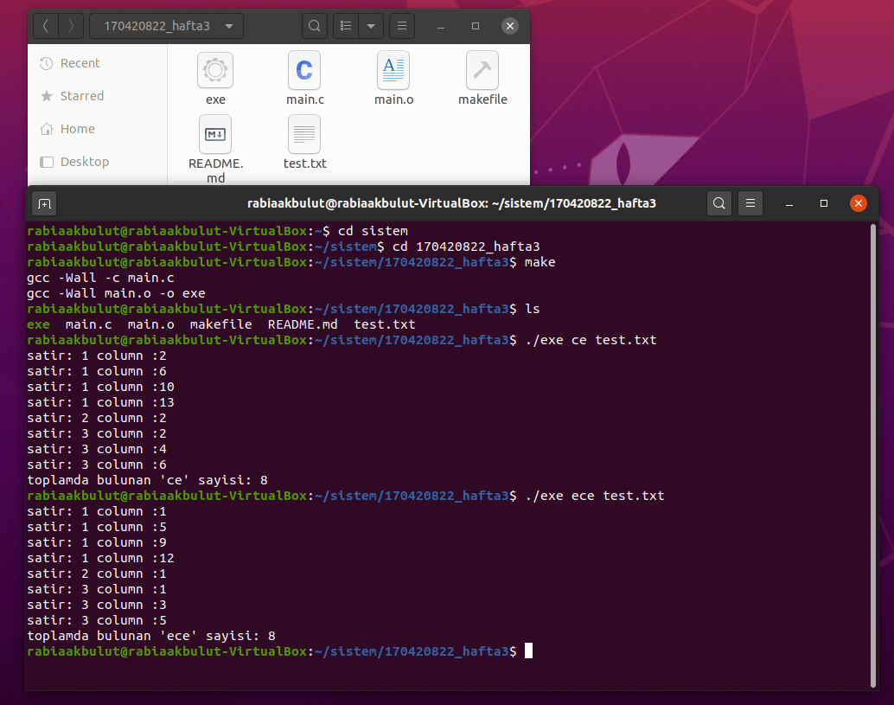
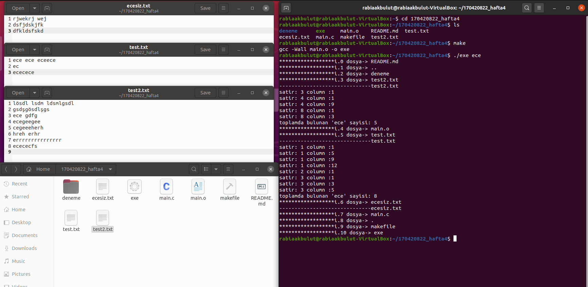

# txt-kelime-bulma
Bu program verilen kelimeyi verilen txt dosyasinda arar.
Kelimeyi buldugunda satir ve sutun bilgilerini dondurur.

Ust versiyon
Aynı klasor icindeki tüm txtlerde arama yapip satir ve sutun dondurur

